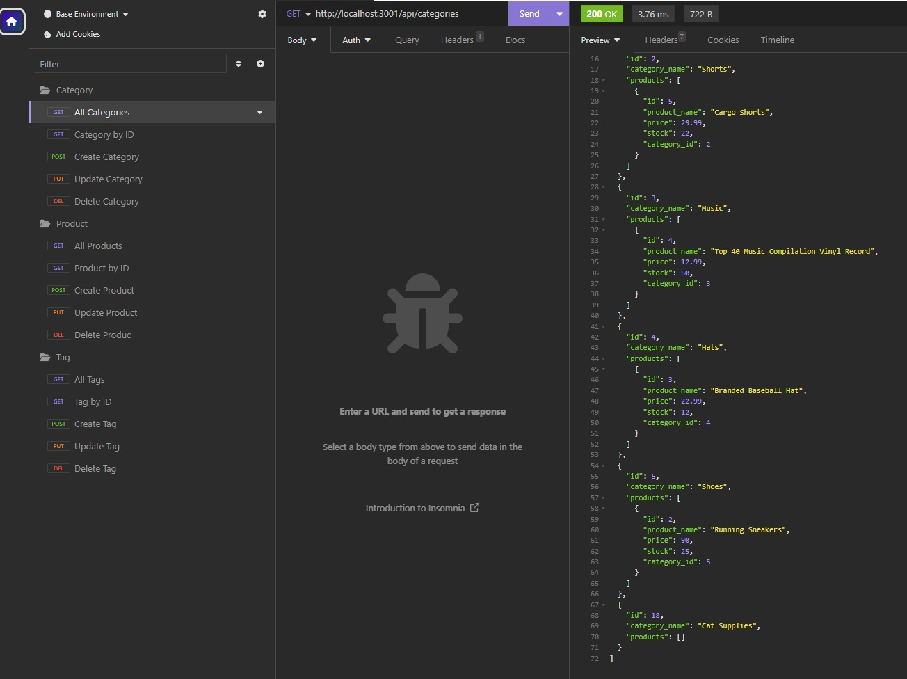
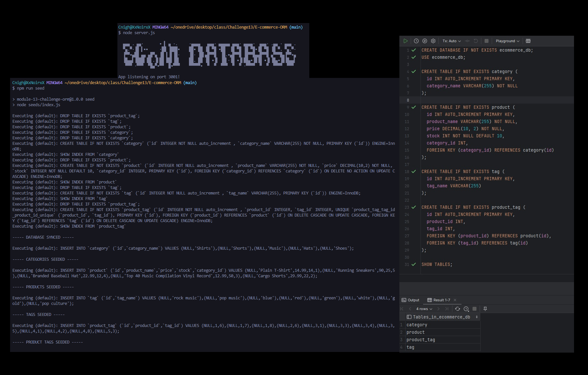

# E-commerce-ORM

## Description
 Build the back end for an e-commerce site. Working Express.js API and configure it to use Sequelize to interact with a MySQL database.

**Note**: I followed the criteria below provided by the class instructors.

## User Story

- AS A manager at an internet retail company
- I WANT a back end for my e-commerce website that uses the latest technologies
- SO THAT my company can compete with other e-commerce companies

## Acceptance Criteria

- GIVEN a functional Express.js API
- WHEN I add my database name, MySQL username, and MySQL password to an environment variable file
- THEN I am able to connect to a database using Sequelize
- WHEN I enter schema and seed commands
- THEN a development database is created and is seeded with test data
- WHEN I enter the command to invoke the application
- THEN my server is started and the Sequelize models are synced to the MySQL database
- WHEN I open API GET routes in Insomnia Core for categories, products, or tags
- THEN the data for each of these routes is displayed in a formatted JSON
- WHEN I test API POST, PUT, and DELETE routes in Insomnia Core
- THEN I am able to successfully create, update, and delete data in my database

- **Note**: 

 ## Installation
 - To install the E-Com DataBase, follow these steps:
 - Clone the repository.
 - Navigate to the project directory.
 - Install the dependencies: npm install
 - Create database in mySQL or Datagrip 
 - Pre-populated your database by copying the code from schema.sql

**Note**: add your own mySQL information to db.js or .env ( add to .gitignore ) for higher security.

 ## Usage
 - To use the E-Com DataBase, run the following command inside the "Root" folder:
 - In terminal enter NPM RUN SEED  , Followed by NODE SERVER.JS
 - Follow [Video Demo](https://www.dropbox.com/scl/fi/wysz3xtee6ufmbjdsmi2z/Challenge13.mp4?rlkey=rkrrhkznonmzg7tv4rcwccai8&dl=0) if you need further assistance.
 

## Mock-Up

The following image shows the application.

**Note**: This image is a screen shot once I finished the assisnment.

## Credits
- [Macro Font](https://patorjk.com/software/taag/#p=display&f=Shadow&t=Employee%20Tracker)
- [W3School](https://www.w3schools.com/sql/default.asp)
- [Youtube](https://www.youtube.com/watch?v=QDoT_znSZF0)
- Study Group Support.
- Project 2 gave extra practice.

**Note**: User story and acceptance criteria was provided to me in class
 UNB-VIRT-FSF-PT-04-2023-U-LOLC for Week 13 Challenge. 

## My Github

- [Github](https://github.com/xNoirNightx/E-commerce-ORM)

## License

